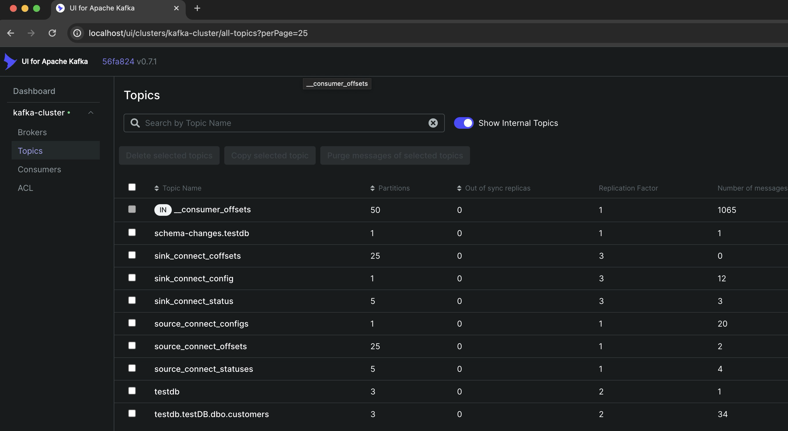

# Project Title

Change data capture (CDC) based on Apache Kafka and Debezium.

## Description

This serves as an illustrative example of a Change Data Capture implementation using Debezium and Kafka. It functions as a playground for those keen on exploring CDC but necessitates fine-tuning for production readiness. We will test table and column filter functionality of Debezium.

## Architecture
This is a standard change data capture archtiecture based on Kafka, Kafka Connect and Debezium pluging for CDC. This architecture can be easily scalabale, made higha avaiable and fault tolerant.

This setup mimics a SQL Server Always On Availability Group, thus Debezium will be connected to read replica.


These are the main architectural components:
* Microsoft SQL Server Availability Group with two nodes: MSSQL Primary and MSSQL Secondary. CDC must be enabled on both, even if Debezium is connected to read prelica.
* Kafka Connect with Debezium plugin 
* Kafka Connect with S3 Sink plugin (Can be a single Kafka Connect image with two source and sink connectors)
* Apach Kafka Raft - uses Raft consensus protocol for metadata management instead of ZooKeeper.
* Amazon S3 bucket - used as data sink destiantion


## Getting Started

### Dependencies

* Docker
* Docker-compose
* AWS account

### Start containers

Start containers using docker-compose
```
docker-compose up -d
```

### Configure source - SQL Servers
Insert some dummy data into Primary SQL Server
```bash
cat sqlserver-init/01-insert-data.sql | docker exec -i mssql-primary bash -c '/opt/mssql-tools/bin/sqlcmd -U sa -P $SA_PASSWORD'
```

Configure SQL Server primary node
```bash
cat sqlserver-init/02-setup-mssql-primary.sql | docker exec -i mssql-primary bash -c '/opt/mssql-tools/bin/sqlcmd -U sa -P $SA_PASSWORD'
```

Configure SQL Server secondary node
```bash
cat sqlserver-init/03-setup-mssql-secondary.sql | docker exec -i mssql-secondary bash -c '/opt/mssql-tools/bin/sqlcmd -U sa -P $SA_PASSWORD'
```

Create a source connector in Debezium plugin of Kafka Connect
```bash
curl -X POST -H  "Content-Type:application/json" http://localhost:8083/connectors/ -d  @kafka-connect-source/register-source-sqlserver.json
```

### Configure destination - AWS S3 bucket
Create a S3 bukcet and an Access Key with privelegeas to read/write into S3 buckets.

Create a S3 sink connector in Kafka Connect for Custoemrs table
```bash
curl -X POST -H  "Content-Type:application/json" http://localhost:8084/connectors/ -d  @kafka-connect-sink/s3-sink-connector-customers.json
```
Create a S3 sink connector in Kafka Connect for Products table
```bash
curl -X POST -H  "Content-Type:application/json" http://localhost:8084/connectors/ -d  @kafka-connect-sink/s3-sink-connector-products.json
```

### Test the setup
Trigger CDC by inserting data in CDC enabled table - customers.
```bash
cat sqlserver-init/04-insert-customers-table.sql | docker exec -i mssql-primary bash -c '/opt/mssql-tools/bin/sqlcmd -U sa -P $SA_PASSWORD'
```

New messages can be noteced in the table topic in Kafka UI


Notice new objects created in S3 bucket. The path - ```topics/<topic.prefix>.<database.names>.<table.include.list>[*]/partition=0```


Trigger CDC by updating data in a CDC enabled table - customers, and column that is no in exluded list.
```bash
cat sqlserver-init/05-update-customers-table-cdc-trigger.sql | docker exec -i mssql-primary bash -c '/opt/mssql-tools/bin/sqlcmd -U sa -P $SA_PASSWORD'
```
Check new messages in the table topic.

Update data in a CDC enabled table - customers, but a column that is in excluded list - last_name. Notice Debezium has not been triggered.
```bash
cat sqlserver-init/06-update-customers-table-no-cdc-trigger.sql | docker exec -i mssql-primary bash -c '/opt/mssql-tools/bin/sqlcmd -U sa -P $SA_PASSWORD'
```

No new message ins Kafka topic nor in S3 bucket.

## Clean up

Any advise for common problems or issues.
```bash
docker-compose down
```

## License

This project is licensed under the Apache License - see the LICENSE.md file for details

## Acknowledgments

Inspiration, code snippets, etc.
* [awesome-readme](https://github.com/matiassingers/awesome-readme)
* [PurpleBooth](https://gist.github.com/PurpleBooth/109311bb0361f32d87a2)
* [dbader](https://github.com/dbader/readme-template)
* [zenorocha](https://gist.github.com/zenorocha/4526327)
* [fvcproductions](https://gist.github.com/fvcproductions/1bfc2d4aecb01a834b46)